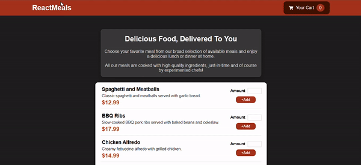

# ReactMeals

This is a dummy project to practice React which user can choose meals and add quantity. The selected meals are added to a Shopping Cart where user can add more or remove.

## Installation

* Clone the repository to your local machine.
* Navigate to the project directory in your terminal.
* Run ``npm install`` to install all required dependencies.

* Run ``npm run dev`` to run development server.
